<div style="position: absolute; top: 0; right: 0;">
    <a href="ertugrulbusiness@gmail.com"></a>
    <a href="https://tr.linkedin.com/in/ertu%C4%9Fruldemir?original_referer=https%3A%2F%2Fwww.google.com%2F"></a>
    <a href="https://github.com/ertugruldmr"></a>
    <a href="https://www.kaggle.com/erturuldemir"></a>
    <a href="https://huggingface.co/ErtugrulDemir"></a>
    <a href="https://stackoverflow.com/users/21569249/ertu%c4%9frul-demir?tab=profile"></a>
    <a href="https://medium.com/@ertugrulbusiness"></a>
    <a href="https://www.youtube.com/channel/UCB0_UTu-zbIsoRBHgpsrlsA"></a>
</div>

# Titanic Survive Situation of Passengers Classification

## __Table Of Content__
- (A) [__Brief__](#brief)
  - [__Project__](#project)
  - [__Data__](#data)
  - [__Demo__](#demo) -> [Live Demo](https://ertugruldemir-creditcardfrauddetection.hf.space)
  - [__Study__](#problemgoal-and-solving-approach) -> [Colab](https://colab.research.google.com/drive/1C1F-Wq6udTCFcdLIYcz4Z1B9Equ1kW9v)
  - [__Results__](#results)
- (B) [__Detailed__](#Details)
  - [__Abstract__](#abstract)
  - [__Explanation of the study__](#explanation-of-the-study)
    - [__(A) Dependencies__](#a-dependencies)
    - [__(B) Dataset__](#b-dataset)
    - [__(C) Pre-processing__](#c-pre-processing)
    - [__(D) Exploratory Data Analysis__](#d-exploratory-data-analysis)
    - [__(E) Modelling__](#e-modelling)
    - [__(F) Saving the project__](#f-saving-the-project)
    - [__(G) Deployment as web demo app__](#g-deployment-as-web-demo-app)
  - [__Licance__](#license)
  - [__Connection Links__](#connection-links)

## __Brief__ 

### __Project__ 
- This is a __classification__ project that uses the  [__Loan Prediction Problem Dataset__](https://www.kaggle.com/datasets/isaikumar/creditcardfraud) to __classify the credit card transections__ into fraud or not fraud.
- The __goal__ is build a model that accurately __detects the frauds__  based on the features. 
- The performance of the model is evaluated using several __metrics__, including _accuracy_, _precision_, _recall_, _F1 score_, _roc curve_, _auc score_, _confusion matrix_ and other imbalanced classification metrics.
#### __Overview__
- This project involves building a machine learning model to classify credit card transections based on nomber of 31 features. The dataset contains 492 frauds and totaly 284.807 records. The target distributions is %98.828 not fraud and %0.172 Fraud, The dataset is highly unbalanced, so undersample and oversample methods are used to get balanced dataset. The models selected according to model tuning results, the progress optimized respectively the previous tune results. The project uses Python and several popular libraries such as Pandas, NumPy, Scikit-learn, Tensorflow.

#### __Demo__

<div align="left">
  <table>
    <tr>
    <td>
        <a target="_blank" href="https://ertugruldemir-creditcardfrauddetection.hf.space">[Demo app] HF Space</a>
      </td>
      <td>
        <a target="_blank" href="https://colab.research.google.com/drive/1nyLwFjnLLtLuIKSVSC4dljIlPDS937FC">[Demo app] Run in Colab</a>
      </td>
      <td>
        <a target="_blank" href="https://github.com/ertugruldmr/CreditCardFraudDetection/blob/main/study.ipynb">[Traning pipeline] source on GitHub</a>
      </td>
    <td>
        <a target="_blank" href="https://colab.research.google.com/drive/1C1F-Wq6udTCFcdLIYcz4Z1B9Equ1kW9v">[Traning pipeline] Run in Colab</a>
      </td>
    </tr>
  </table>
</div>


- Description
    - __classify the passenger survive situation__  based on features.
    - __Usage__: Set the feature values through sliding the radio buttons then use the button to predict.
- Embedded [Demo]() window from HuggingFace Space
    

<iframe
	src="https://ertugruldemir-creditcardfrauddetection.hf.space"
	frameborder="0"
	width="850"
	height="450"
></iframe>

#### __Data__
- The [__Loan Prediction Problem Dataset__](https://www.kaggle.com/datasets/isaikumar/creditcardfraud) from kaggle platform.
- The dataset contains 31 features and a target variable with binary classes as fraud or not. The target distribution is unbalanced certainly.
- The data attributes has already transformed, implemented PCA and renamed because of the bank data policy.
- The dataset contains the following features:
<table>
<tr><th>Data Info </th><th><div style="padding-left: 50px;">Stats</div></th></tr>
<tr><td>

| # | Column | Non-Null Count | Dtype     |
|---|--------|---------------|-----------|
| 0 | Time   | 284807        | float64  |
| 1 | V1     | 284807        | float64  |
| 2 | V2     | 284807        | float64  |
| 3 | V3     | 284807        | float64  |
| 4 | V4     | 284807        | float64  |
| 5 | V5     | 284807        | float64  |
| 6 | V6     | 284807        | float64  |
| 7 | V7     | 284807        | float64  |
| 8 | V8     | 284807        | float64  |
| 9 | V9     | 284807        | float64  |
| 10| V10    | 284807        | float64  |
| 11| V11    | 284807        | float64  |
| 12| V12    | 284807        | float64  |
| 13| V13    | 284807        | float64  |
| 14| V14    | 284807        | float64  |
| 15| V15    | 284807        | float64  |
| 16| V16    | 284807        | float64  |
| 17| V17    | 284807        | float64  |
| 18| V18    | 284807        | float64  |
| 19| V19    | 284807        | float64  |
| 20| V20    | 284807        | float64  |
| 21| V21    | 284807        | float64  |
| 22| V22    | 284807        | float64  |
| 23| V23    | 284807        | float64  |
| 24| V24    | 284807        | float64  |
| 25| V25    | 284807        | float64  |
| 26| V26    | 284807        | float64  |
| 27| V27    | 284807        | float64  |
| 28| V28    | 284807        | float64  |
| 29| Amount | 284807        | float64  |
| 30| Class  | 284807        | int64  |


</td><td>

<div style="flex: 50%; padding-left: 50px;">

|Column | mean           | std        | min        | 25%         | 50%       | 75%         | max       |
|------|----------------|------------|------------|-------------|-----------|-------------|-----------|
|V1    |284807.0        |1.168375e-15|1.958696    |-56.407510   |-0.920373  |0.018109     |2.454930   |
|V2    |284807.0        |3.416908e-16|1.651309    |-72.715728   |-0.598550  |0.065486     |22.057729 |
|V3    |284807.0        |-1.379537e-15|1.516255   |-48.325589   |-0.890365  |0.179846     |9.382558  |
|V4    |284807.0        |2.074095e-15|1.415869    |-5.683171    |-0.848640  |-0.019847    |16.875344 |
|V5    |284807.0        |9.604066e-16|1.380247    |-113.743307  |-0.691597  |-0.054336    |34.801666 |
|V6    |284807.0        |1.487313e-15|1.332271    |-26.160506   |-0.768296  |-0.274187    |73.301626 |
|V7    |284807.0        |-5.556467e-16|1.237094   |-43.557242   |-0.554076  |0.040103     |120.589494|
|V8    |284807.0        |1.213481e-16|1.194353    |-73.216718   |-0.208630  |0.022358     |20.007208 |
|V9    |284807.0        |-2.406331e-15|1.098632   |-13.434066   |-0.643098  |-0.051429    |15.594995 |
|V10   |284807.0        |2.239053e-15|1.088850    |-24.588262   |-0.535426  |-0.092917    |23.745136 |
|V11   |284807.0        |1.673327e-15|1.020713    |-4.797473    |-0.762494  |-0.032757    |12.018913 |
|V12   |284807.0        |-1.247012e-15|0.999201   |-18.683715   |-0.405571  |0.140033     |7.848392  |
|V13   |284807.0        |8.190001e-16|0.995274    |-5.791881    |-0.648539  |-0.013568    |7.126883  |
|V14   |284807.0        |1.207294e-15|0.958596    |-19.214325   |-0.425574  |0.050601     |10.526766 |
| V15  | 284807.0       | 4.887456e-15   | 0.915316    | -4.498945 | -0.582884 | 0.048072 | 0.648821 | 8.877742 |
| V16  | 284807.0       | 1.437716e-15   | 0.876253    | -14.129855| -0.468037 | 0.066413 | 0.523296 | 17.315112 |
| V17  | 284807.0       | -3.772171e-16  | 0.849337    | -25.162799| -0.483748 | -0.065676 | 0.399675 | 9.253526 |
| V18  | 284807.0       | 9.564149e-16   | 0.838176    | -9.498746 | -0.498850 | -0.003636 | 0.500807 | 5.041069 |
| V19  | 284807.0       | 1.039917e-15   | 0.814041    | -7.213527 | -0.456299 | 0.003735 | 0.458949 | 5.591971 |
| V20  | 284807.0       | 6.406204e-16   | 0.770925    | -54.497720| -0.211721 | -0.062481 | 0.133041 | 39.420904 |
| V21  | 284807.0       | 1.654067e-16   | 0.734524    | -34.830382| -0.228395 | -0.029450 | 0.186377 | 27.202839 |
| V22  | 284807.0       | -3.568593e-16  | 0.725702    | -10.933144| -0.542350 | 0.006782 | 0.528554 | 10.503090 |
| V23  | 284807.0       | 2.578648e-16   | 0.624460    | -44.807735| -0.161846 | -0.011193 | 0.147642 | 22.528412 |
| V24  | 284807.0       | 4.473266e-15   | 0.605647    | -2.836627  | -0.354586 | 0.040976 | 0.439527 | 4.584549 |
| V25  | 284807.0       | 5.340915e-16   | 0.521278    | -10.295397  | -0.317145 | 0.016594 | 0.350716 | 7.519589 |
| V26  | 284807.0       | 1.683437e-15   | 0.482227    | -2.604551  | -0.326984 | -0.052139 | 0.240952 | 3.517346 |
| V27  | 284807.0       | -3.660091e-16  | 0.403632    | -22.565679  | -0.070840 | 0.001342 | 0.091045 | 31.612198 |
| V28           | 284807.0 | -1.227390e-16 | 0.330083   | -15.430084 | -0.052960  | 0.011244   | 0.078280   | 33.847808 |
| Class         | 284807.0 | 1.727486e-03  | 0.041527   | 0.000000   | 0.000000   | 0.000000   | 0.000000   | 1.000000   |
| scaled_amount | 284807.0 | 9.271239e-01  | 3.495006   | -0.307413 | -0.229162  | 0.000000   | 0.770838   | 358.683155 |
| scaled_time   | 284807.0 | 1.189142e-01  | 0.557903   | -0.994983 | -0.358210  | 0.000000   | 0.641790   | 1.035022   |


</div>

</td></tr> </table>

<div style="text-align: center;">
    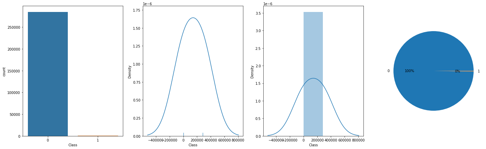
</div>

#### Problem, Goal and Solving approach
- This is a __Bimary classification__ problem on highly unbalanced data that uses the a bank dataset [__Loan Prediction Problem Dataset__](https://www.kaggle.com/datasets/isaikumar/creditcardfraud) from kaggle platform to __Detect Frauds__ as Fraud or not Fraud based on 31 features.
- The __goal__ is to build a model that accurately __detects the fraud transections__ based on the features.
- __Solving approach__ is that using the supervised machine learning models (linear, non-linear, ensemly) on the dataset through convenient processes such as random undersampling, oversampling, etc...

#### Study
The project aimed classifying the passengers using the features. The study includes following chapters.
- __(A) Dependencies__: Installations and imports of the libraries.
- __(B) Dataset__: Downloading and loading the dataset.
- __(C) Pre-processing__: It includes data type casting, scaling, resampling for balancity, missing value hadnling, outlier handling. NOTE: Random undersampling with __imblearn.under_sampling.NearMiss__, oversampling with __imblearn.over_sampling.SMOTE__
- __(D) Exploratory Data Analysis__: Univariate, Bivariate, Multivariate anaylsises. Correlation and other relations. Roc curve, auc score, confusion matrix and related classification processes. 
- __(E) Modelling__: Model tuning via GridSearch on Linear, Non-linear, Ensemble Models. Additionaly a custom deep lerning model applied as fully connected neural network classifier.  
- __(F) Saving the project__: Saving the project and demo studies.
- __(G) Deployment as web demo app__: Creating Gradio Web app to Demostrate the project.Then Serving the demo via huggingface as live.

#### results
- The final model is __logistic regression__ because of the results and less complexity.
    - Note that: Scores collected on whole original data. But the models traind on resampled dataset with cross validation. 
    - You can find details in the  details -> study section (Roc curve, Auc score, Confusion matrix etc...).
<div style="flex: 50%; padding-left: 80px;">

|   | Technique | accuracy | precision | recall | f1_score | auc |
|---|-----------|----------|-----------|--------|----------|-----|
| loj_reg_us | Random UnderSampling | 0.268 | 0.003 | 0.987 | 0.006 | 0.627 |
| loj_reg_os | OverSampling | 0.983 | 0.084 | 0.886 | 0.153 | 0.935 |

</div>

- Model tuning results are below.

<table>
<tr><th>Linear Model Tuning Results without balanciy process</th></tr>
<tc><td>

|      | MaxError | MeanAbsoluteError | MeanAbsolutePercentageError |   MSE   |  RMSE  |   MAE   |    R2    | ExplainedVariance |
|------|---------|------------------|------------------------------|---------|--------|---------|----------|-------------------|
| lin_reg | 0.728557 | 0.071066 | 0.071066 | 1.0 | 0.0 | inf | 0.713603 | 0.266582 |
| l1_reg | 1.0 | 0.0 | inf | 0.076142 | 0.275939 | 0.076142 | 0.693146 | 0.705711 |
| l2_reg | 0.0 | 1.0 | inf | 0.543147 | 0.736985 | 0.543147 | -1.188889 | 0.0 |
| enet_reg | 1.0 | 0.0 | inf | 0.076142 | 0.275939 | 0.076142 | 0.693146 | 0.705711 |


</td><td> </table>


<table>
<tr><th>Non-Linear Model Tuning without balanciy process</th><th><div style="padding-left: 175px;">Ensemble Model Tuning without balanciy process</div></th></tr>

<tr><td>

|         | accuracy | precision |  recall  | f1_score |
|---------|---------:|----------:|---------:|---------:|
| loj_reg |  0.93401 |   0.93401 |  0.93401 |  0.93401 |
| nb_params | 0.918782 | 0.918782 | 0.918782 | 0.918782 |
|    knn  | 0.944162 | 0.944162 | 0.944162 | 0.944162 |
|    svc  | 0.949239 | 0.949239 | 0.949239 | 0.949239 |
|     dt  | 0.913706 | 0.913706 | 0.913706 | 0.913706 |


</td><td>
<div style="flex: 50%; padding-left: 175px;">


| accuracy | precision |  recall  | f1_score |
|:--------:|:---------:|:--------:|:--------:|
|    rf    |  0.949239 | 0.949239 | 0.949239 |
|   gbc    |  0.954315 | 0.954315 | 0.954315 |
|   xgbc   |  0.954315 | 0.954315 | 0.954315 |
|   lgbm   |  0.949239 | 0.949239 | 0.949239 |
|    cb    |  0.959391 | 0.959391 | 0.959391 |


</div>

</td></tr> </table>


<table>
<tr><th>Non-Linear Model Tuning with random undersampling</th><th><div style="padding-left: 175px;">Ensemble Model Tuning with random undersampling</div></th></tr>

<tr><td>

| Model | Precision | Recall | F1-Score | Support |
| --- | --- | --- | --- | --- |
| loj_reg 
| No Fraud |1.00 | 0.81 | 0.90 | 56863 |
| Fraud | 0.01 | 0.91 | 0.02 | 98 |
| accuracy | | | 0.81 | 56961 |
| micro avg | 0.81 | 0.81 | 0.81 | 56961 |
| weighted avg | 1.00 | 0.81 | 0.89 | 56961 |
| --- | --- | --- | --- | --- |
| nb_params 
| No Fraud | 1.00 | 0.35 | 0.52 | 56863 |
| Fraud | 0.00 | 0.96 | 0.01 | 98 |
| accuracy | | | 0.35 | 56961 |
| micro avg | 0.35 | 0.35 | 0.35 | 56961 |
| weighted avg | 1.00 | 0.35 | 0.52 | 56961 |
| --- | --- | --- | --- | --- |
| knn 
| No Fraud | 1.00 | 0.70 | 0.83 | 56863 |
| Fraud| 0.01 | 0.93 | 0.01 | 98 |
| accuracy | | | 0.71 | 56961 |
| micro avg | 0.71 | 0.71 | 0.71 | 56961 |
| weighted avg | 1.00 | 0.71 | 0.83 | 56961 |
| --- | --- | --- | --- | --- |
| svc 
| No Fraud| 1.00 | 0.64 | 0.78 | 56863 |
| Fraud| 0.00 | 0.95 | 0.01 | 98 |
| accuracy | | | 0.64 | 56961 |
| micro avg | 0.64 | 0.64 | 0.64 | 56961 |
| weighted avg | 1.00 | 0.64 | 0.78 | 56961 |
| --- | --- | --- | --- | --- |
| dt 
| No Fraud| 1.00 | 0.07 | 0.13 | 56863 |
| Fraud| 0.00 | 0.98 | 0.00 | 98 |
| accuracy | | | 0.07 | 56961 |
| micro avg | 0.07 | 0.07 | 0.07 | 56961 |
| weighted avg | 1.00 | 0.07 | 0.13 | 56961 |

</td><td>
<div style="flex: 50%; padding-left: 175px;">

| Model | Precision | Recall | F1-Score | Support |
| --- | --- | --- | --- | --- |
| rf 
| No Fraud| 1.00 | 0.03 | 0.06 | 56863 |
| Fraud| 0.00 | 0.99 | 0.00 | 98 |
| accuracy | | | 0.03 | 56961 |
| micro avg | 0.03 | 0.03 | 0.03 | 56961 |
| weighted avg | 1.00 | 0.03 | 0.06 | 56961 |
| --- | --- | --- | --- | --- |
| gbc
| No Fraud        | 1.00      | 0.05   | 0.09     | 56863   |
| Fraud           | 0.00      | 0.99   | 0.00     | 98      |
| accuracy        |           | 0.05   |          | 56961   |
| macro avg       | 0.50      | 0.52   | 0.05     | 56961   |
| weighted avg    | 1.00      | 0.05   | 0.09     | 56961   |
| --- | --- | --- | --- | --- |
| xgbc
| No Fraud        | 1.00      | 0.08   | 0.14     | 56863   |
| Fraud           | 0.00      | 0.99   | 0.00     | 98      |
| accuracy        |           | 0.08   |          | 56961   |
| macro avg       | 0.50      | 0.53   | 0.07     | 56961   |
| weighted avg    | 1.00      | 0.08   | 0.14     | 56961   |
| --- | --- | --- | --- | --- |
| lgbm
| No Fraud        | 1.00      | 0.09   | 0.16     | 56863   |
| Fraud           | 0.00      | 0.99   | 0.00     | 98      |
| accuracy        |           | 0.09   |          | 56961   |
| macro avg       | 0.50      | 0.54   | 0.08     | 56961   |
| weighted avg    | 1.00      | 0.09   | 0.16     | 56961   |
| --- | --- | --- | --- | --- |
| cb
| No Fraud        | 1.00      | 0.08   | 0.16     | 56863   |
| Fraud           | 0.00      | 0.99   | 0.00     | 98      |
| accuracy        |           | 0.09   |          | 56961   |
| macro avg       | 0.50      | 0.54   | 0.08     | 56961   |
| weighted avg    | 1.00      | 0.09   | 0.15     | 56961   |

</div>

</td></tr> </table>


## Details

### Abstract
- [__Loan Prediction Problem Dataset__](https://www.kaggle.com/datasets/isaikumar/creditcardfraud) is used to detects the fraud credit card transections. The dataset has 284.807 records and two class (Fraud, not Fraud). The problem is supervised learning task as binary classification. The goal is the detecting  the Fraud transections correctly through using supervised machine learning algorithms such as non-linear, ensemble, neural networkds (Deep learning) and smilar model.The study includes creating the environment, getting the data, preprocessing the data, exploring the data, modelling the data, saving the results, deployment as demo app. The data is highly unbalanced so resampling methods implemented such as random undersampling, oversampling. Training phase of the models implemented through cross validation and Grid Search model tuning approachs. Hyperparameter tuning implemented Greedy Greed Search approach which tunes a hyper param at once a time while iterating the sorted order according the importance of the hyperparams. Models are evaluated with cross validation methods using 5 split. Classification results collected and compared between the models. Selected the basic and more succesful fraud detectore models according to unbalanced data classification metrics which is the __logistic regression__ with __Oversampling__ method. Tuned __Logistic regression OS__ model has __%98__ | accuracy, __0.084__ precision, __0.886__ recall, __0.153__ f1_score, __0.935__ auc, the other metrics are also found the results section such as _ROC Curve_. End of the study created a demo and served on huggingface space.  
### File Structures

- File Structure Tree
```bash
├── demo_app
│   ├── app.py
│   ├── component_configs.json
│   └── loj_reg_os.sav
├── docs
│   └── images
├── env
│   ├── env_installation.md
│   └── requirements.txt
├── LICENSE
├── readme.md
└── study.ipynb
```
- Description of the files
  - demo_app/
    - Includes the demo web app files, it has the all the requirements in the folder so it can serve on anywhere.
  - demo_app/component_configs.json :
    - It includes the web components to generate web page.
  - demo_app/loj_reg_os.sav:
    - The trained (Model Tuned) model as logistic Regression instance from sklearn library on Oversampled dataset.
  - docs/
    - Includes the documents about results and presentations
  - env/
    - It includes the training environmet related files. these are required when you run the study.ipynb file.
  - LICENSE.txt
    - It is the pure apache 2.0 licence. It isn't edited.
  - readme.md
    - It includes all the explanations about the project
  - study.ipynb
    - It is all the studies about solving the problem which reason of the dataset existance.    


### Explanation of the Study
#### __(A) Dependencies__:
  -  There is a third-parth installation as kaggle dataset api, just follow the study codes it will be handled. The libraries which already installed on the environment are enough. You can create an environment via env/requirements.txt. Create a virtual environment then use hte following code. It is enough to satisfy the requirements for runing the study.ipynb which training pipeline.
#### __(B) Dataset__: 
  - Downloading the [__Loan Prediction Problem Dataset__](https://www.kaggle.com/datasets/isaikumar/creditcardfraud) via kaggle dataset api from kaggle platform. The dataset has 284.807  records.The target has Binary classes as Fraud or not.  There are 31 features which are numerical type.The target variable has two class as Fraud or not survived. for more info such as histograms and etc... you can look the '(D) Exploratory Data Analysis' chapter.
#### __(C) Pre-processing__: 
  - The processes are below:
    - Preparing the dtypes such as casting the object type to categorical type.
    - Scaling the featuers to get same form between not scaled and already scaled features.
    - Unbalancity Analysis:
      - Implementing the following resample methods to get balanced dataset.
        - Creating Random Undersampling dataset version
          - Random data selection
          - Implementing NearMiss method
        - Creating Oversampling dataset version
          - Implementing the SMOTE method.
    - The missing value is not found.
    - Outlier analysis using the both visual and OQR calculation apporachs. According to IQR approach detected statistically significant outliers are handled using boundary value casting assignment method.

      <div style="text-align: center;">
          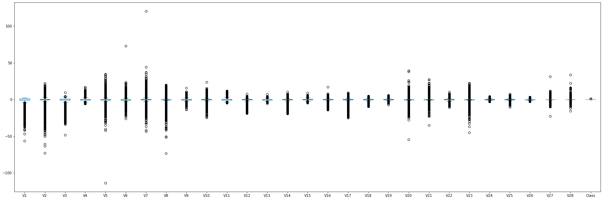
      </div>
 
#### __(D) Exploratory Data Analysis__:
  - Dataset Stats
     <table>
      <tr><th>Data Info </th><th><div style="padding-left: 50px;">Stats</div></th></tr>
      <tr><td>

      | # | Column | Non-Null Count | Dtype     |
      |---|--------|---------------|-----------|
      | 0 | Time   | 284807        | float64  |
      | 1 | V1     | 284807        | float64  |
      | 2 | V2     | 284807        | float64  |
      | 3 | V3     | 284807        | float64  |
      | 4 | V4     | 284807        | float64  |
      | 5 | V5     | 284807        | float64  |
      | 6 | V6     | 284807        | float64  |
      | 7 | V7     | 284807        | float64  |
      | 8 | V8     | 284807        | float64  |
      | 9 | V9     | 284807        | float64  |
      | 10| V10    | 284807        | float64  |
      | 11| V11    | 284807        | float64  |
      | 12| V12    | 284807        | float64  |
      | 13| V13    | 284807        | float64  |
      | 14| V14    | 284807        | float64  |
      | 15| V15    | 284807        | float64  |
      | 16| V16    | 284807        | float64  |
      | 17| V17    | 284807        | float64  |
      | 18| V18    | 284807        | float64  |
      | 19| V19    | 284807        | float64  |
      | 20| V20    | 284807        | float64  |
      | 21| V21    | 284807        | float64  |
      | 22| V22    | 284807        | float64  |
      | 23| V23    | 284807        | float64  |
      | 24| V24    | 284807        | float64  |
      | 25| V25    | 284807        | float64  |
      | 26| V26    | 284807        | float64  |
      | 27| V27    | 284807        | float64  |
      | 28| V28    | 284807        | float64  |
      | 29| Amount | 284807        | float64  |
      | 30| Class  | 284807        | int64  |


      </td><td>

      <div style="flex: 50%; padding-left: 50px;">

      |Column | mean           | std        | min        | 25%         | 50%       | 75%         | max       |
      |------|----------------|------------|------------|-------------|-----------|-------------|-----------|
      |V1    |284807.0        |1.168375e-15|1.958696    |-56.407510   |-0.920373  |0.018109     |2.454930   |
      |V2    |284807.0        |3.416908e-16|1.651309    |-72.715728   |-0.598550  |0.065486     |22.057729 |
      |V3    |284807.0        |-1.379537e-15|1.516255   |-48.325589   |-0.890365  |0.179846     |9.382558  |
      |V4    |284807.0        |2.074095e-15|1.415869    |-5.683171    |-0.848640  |-0.019847    |16.875344 |
      |V5    |284807.0        |9.604066e-16|1.380247    |-113.743307  |-0.691597  |-0.054336    |34.801666 |
      |V6    |284807.0        |1.487313e-15|1.332271    |-26.160506   |-0.768296  |-0.274187    |73.301626 |
      |V7    |284807.0        |-5.556467e-16|1.237094   |-43.557242   |-0.554076  |0.040103     |120.589494|
      |V8    |284807.0        |1.213481e-16|1.194353    |-73.216718   |-0.208630  |0.022358     |20.007208 |
      |V9    |284807.0        |-2.406331e-15|1.098632   |-13.434066   |-0.643098  |-0.051429    |15.594995 |
      |V10   |284807.0        |2.239053e-15|1.088850    |-24.588262   |-0.535426  |-0.092917    |23.745136 |
      |V11   |284807.0        |1.673327e-15|1.020713    |-4.797473    |-0.762494  |-0.032757    |12.018913 |
      |V12   |284807.0        |-1.247012e-15|0.999201   |-18.683715   |-0.405571  |0.140033     |7.848392  |
      |V13   |284807.0        |8.190001e-16|0.995274    |-5.791881    |-0.648539  |-0.013568    |7.126883  |
      |V14   |284807.0        |1.207294e-15|0.958596    |-19.214325   |-0.425574  |0.050601     |10.526766 |
      | V15  | 284807.0       | 4.887456e-15   | 0.915316    | -4.498945 | -0.582884 | 0.048072 | 0.648821 | 8.877742 |
      | V16  | 284807.0       | 1.437716e-15   | 0.876253    | -14.129855| -0.468037 | 0.066413 | 0.523296 | 17.315112 |
      | V17  | 284807.0       | -3.772171e-16  | 0.849337    | -25.162799| -0.483748 | -0.065676 | 0.399675 | 9.253526 |
      | V18  | 284807.0       | 9.564149e-16   | 0.838176    | -9.498746 | -0.498850 | -0.003636 | 0.500807 | 5.041069 |
      | V19  | 284807.0       | 1.039917e-15   | 0.814041    | -7.213527 | -0.456299 | 0.003735 | 0.458949 | 5.591971 |
      | V20  | 284807.0       | 6.406204e-16   | 0.770925    | -54.497720| -0.211721 | -0.062481 | 0.133041 | 39.420904 |
      | V21  | 284807.0       | 1.654067e-16   | 0.734524    | -34.830382| -0.228395 | -0.029450 | 0.186377 | 27.202839 |
      | V22  | 284807.0       | -3.568593e-16  | 0.725702    | -10.933144| -0.542350 | 0.006782 | 0.528554 | 10.503090 |
      | V23  | 284807.0       | 2.578648e-16   | 0.624460    | -44.807735| -0.161846 | -0.011193 | 0.147642 | 22.528412 |
      | V24  | 284807.0       | 4.473266e-15   | 0.605647    | -2.836627  | -0.354586 | 0.040976 | 0.439527 | 4.584549 |
      | V25  | 284807.0       | 5.340915e-16   | 0.521278    | -10.295397  | -0.317145 | 0.016594 | 0.350716 | 7.519589 |
      | V26  | 284807.0       | 1.683437e-15   | 0.482227    | -2.604551  | -0.326984 | -0.052139 | 0.240952 | 3.517346 |
      | V27  | 284807.0       | -3.660091e-16  | 0.403632    | -22.565679  | -0.070840 | 0.001342 | 0.091045 | 31.612198 |
      | V28           | 284807.0 | -1.227390e-16 | 0.330083   | -15.430084 | -0.052960  | 0.011244   | 0.078280   | 33.847808 |
      | Class         | 284807.0 | 1.727486e-03  | 0.041527   | 0.000000   | 0.000000   | 0.000000   | 0.000000   | 1.000000   |
      | scaled_amount | 284807.0 | 9.271239e-01  | 3.495006   | -0.307413 | -0.229162  | 0.000000   | 0.770838   | 358.683155 |
      | scaled_time   | 284807.0 | 1.189142e-01  | 0.557903   | -0.994983 | -0.358210  | 0.000000   | 0.641790   | 1.035022   |


      </div>

      </td></tr> </table>
  - Variable Analysis
    - Univariate analysis, 
      <div style="text-align: center;">
          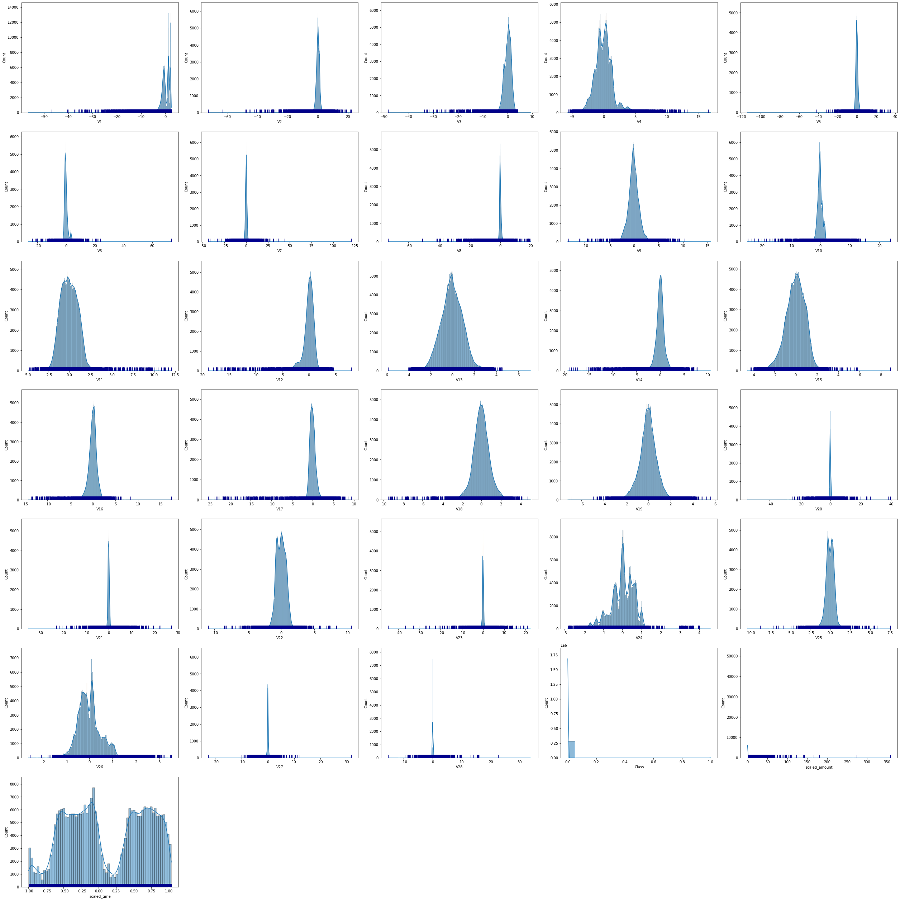
          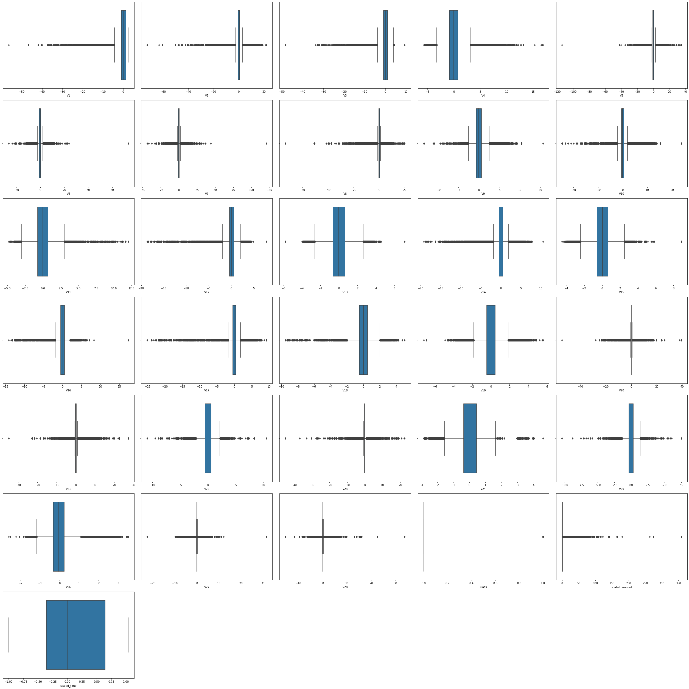
      </div>
    - Bivariate analysis
      <div style="text-align: center;">
          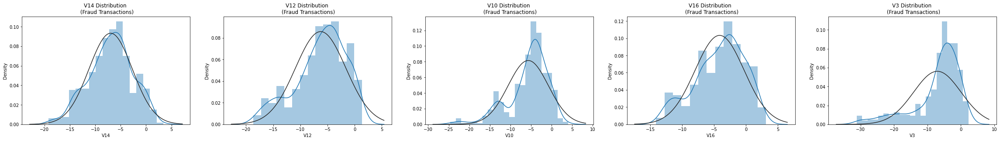
          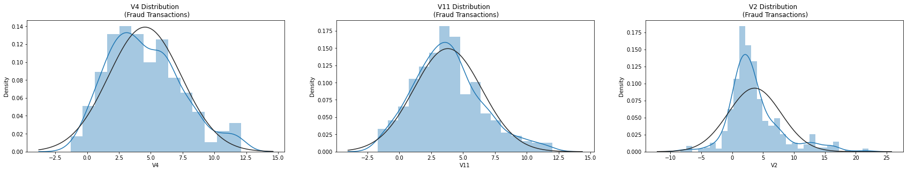
          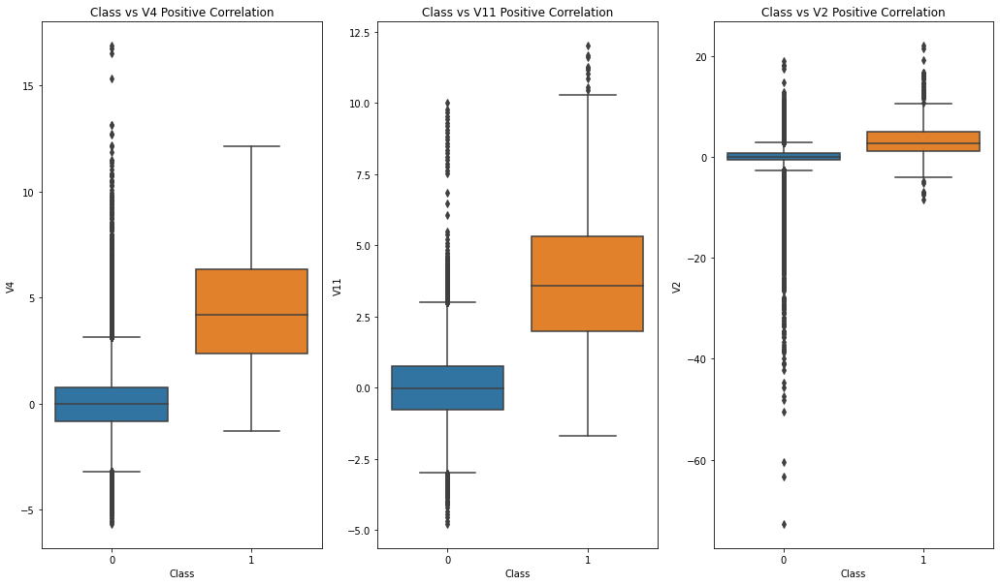
          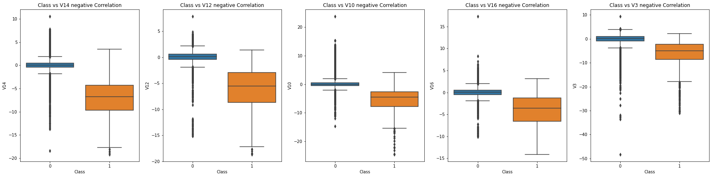
      </div>
    - Multivariate analysis.
      <div style="text-align: center;">
          <p>Most correlated variables with target (V14, V17, Target)</p>
          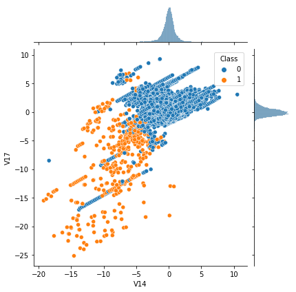
          
      </div>
  - Other relations.
    <div style="display:flex; justify-content: center; align-items:center;">
      <div style="text-align: center;">
      <figure>
      <p>Correlation</p>
      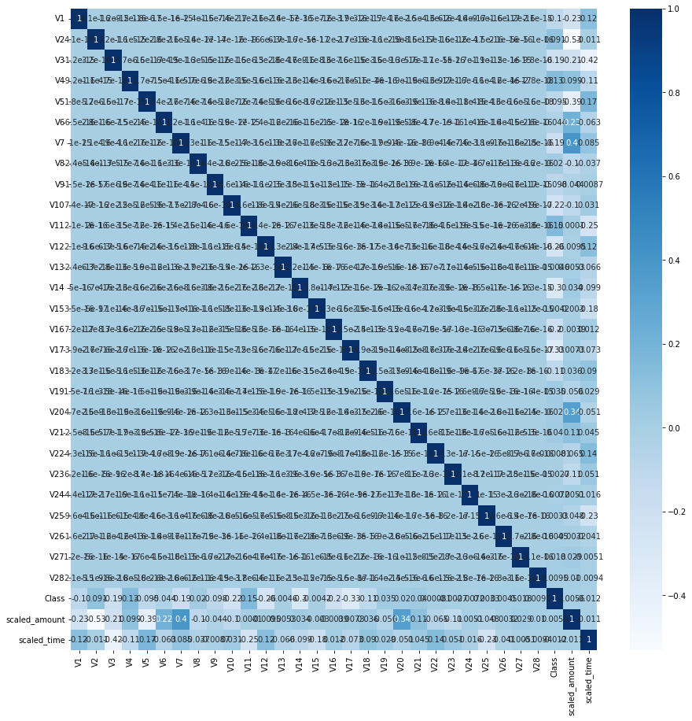
      </figure>
      </div>
      <div style="text-align: center;">
      <figure>
      <p>Variance</p>
      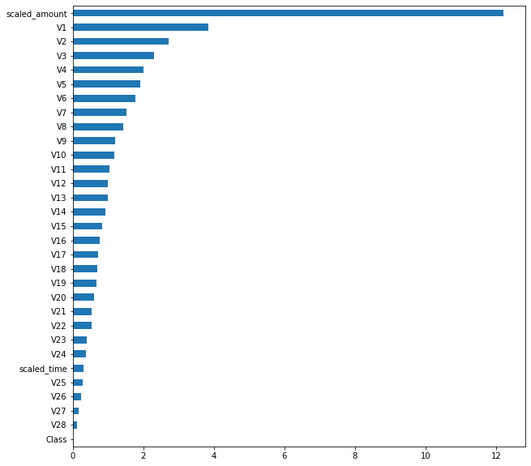
      </figure>
      </div>
      <div style="text-align: center;">
      <figure>
      <p>Covariance</p>
      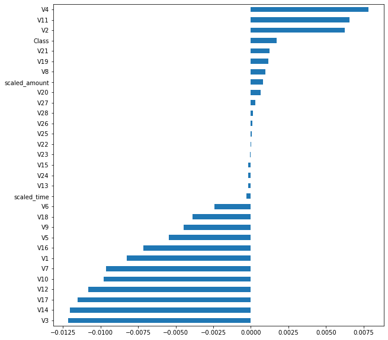
      </figure>
      </div>
    </div>

#### __(E) Modelling__: 
  - Data Split
    - Splitting the dataset via  sklearn.model_selection.train_test_split (test_size = 0.2).
  - Util Functions
    - Greedy Step Tune
      - It is a custom tuning approach created by me. It tunes just a hyperparameter per step using through GridSerchCV. It assumes the params ordered by importance so it reduces the computation and time consumption.  
    - Model Tuner
      - It is an abstraction of the whole training process. It aims to reduce the code complexity. It includes the corss validation and GridSerachCV approachs to implement training process.
    - Learning Curve Plotter
      - Plots the learning curve of the already trained models to provide insight.
  - Linear Model Tuning Results _without balanciy process_
    - linear, l1, l2, enet regressions
    - Cross Validation Scores
      |      | MaxError | MeanAbsoluteError | MeanAbsolutePercentageError |   MSE   |  RMSE  |   MAE   |    R2    | ExplainedVariance |
      |------|---------|------------------|------------------------------|---------|--------|---------|----------|-------------------|
      | lin_reg | 0.728557 | 0.071066 | 0.071066 | 1.0 | 0.0 | inf | 0.713603 | 0.266582 |
      | l1_reg | 1.0 | 0.0 | inf | 0.076142 | 0.275939 | 0.076142 | 0.693146 | 0.705711 |
      | l2_reg | 0.0 | 1.0 | inf | 0.543147 | 0.736985 | 0.543147 | -1.188889 | 0.0 |
      | enet_reg | 1.0 | 0.0 | inf | 0.076142 | 0.275939 | 0.076142 | 0.693146 | 0.705711 |
  - Non-Linear Models
    - Logistic Regression, Naive Bayes, K-Nearest Neighbors, Support Vector Machines, Decision Tree
    - Cross Validation Scores _without balanciy process_
      |         | accuracy | precision |  recall  | f1_score |
      |---------|---------:|----------:|---------:|---------:|
      | loj_reg |  0.93401 |   0.93401 |  0.93401 |  0.93401 |
      | nb_params | 0.918782 | 0.918782 | 0.918782 | 0.918782 |
      |    knn  | 0.944162 | 0.944162 | 0.944162 | 0.944162 |
      |    svc  | 0.949239 | 0.949239 | 0.949239 | 0.949239 |
      |     dt  | 0.913706 | 0.913706 | 0.913706 | 0.913706 |
                  
    - Cross Validation Scores __with Random Undersampling__
      | Model | Precision | Recall | F1-Score | Support |
      | --- | --- | --- | --- | --- |
      | loj_reg 
      | No Fraud |1.00 | 0.81 | 0.90 | 56863 |
      | Fraud | 0.01 | 0.91 | 0.02 | 98 |
      | accuracy | | | 0.81 | 56961 |
      | micro avg | 0.81 | 0.81 | 0.81 | 56961 |
      | weighted avg | 1.00 | 0.81 | 0.89 | 56961 |
      | --- | --- | --- | --- | --- |
      | nb_params 
      | No Fraud | 1.00 | 0.35 | 0.52 | 56863 |
      | Fraud | 0.00 | 0.96 | 0.01 | 98 |
      | accuracy | | | 0.35 | 56961 |
      | micro avg | 0.35 | 0.35 | 0.35 | 56961 |
      | weighted avg | 1.00 | 0.35 | 0.52 | 56961 |
      | --- | --- | --- | --- | --- |
      | knn 
      | No Fraud | 1.00 | 0.70 | 0.83 | 56863 |
      | Fraud| 0.01 | 0.93 | 0.01 | 98 |
      | accuracy | | | 0.71 | 56961 |
      | micro avg | 0.71 | 0.71 | 0.71 | 56961 |
      | weighted avg | 1.00 | 0.71 | 0.83 | 56961 |
      | --- | --- | --- | --- | --- |
      | svc 
      | No Fraud| 1.00 | 0.64 | 0.78 | 56863 |
      | Fraud| 0.00 | 0.95 | 0.01 | 98 |
      | accuracy | | | 0.64 | 56961 |
      | micro avg | 0.64 | 0.64 | 0.64 | 56961 |
      | weighted avg | 1.00 | 0.64 | 0.78 | 56961 |
      | --- | --- | --- | --- | --- |
      | dt 
      | No Fraud| 1.00 | 0.07 | 0.13 | 56863 |
      | Fraud| 0.00 | 0.98 | 0.00 | 98 |
      | accuracy | | | 0.07 | 56961 |
      | micro avg | 0.07 | 0.07 | 0.07 | 56961 |
      | weighted avg | 1.00 | 0.07 | 0.13 | 56961 |
      | Neural Network (Fully Connected Classifier) undersampled 
      | - |0.3447 | 0.0025 | 0.9485  | 0.0049 |


    - Cross Validation Score of lojistic regresion __Oversampled data__ 
      - Implemented best one on previous results because of the computation cost on oversampled data.  
        |    | accuracy | precision | recall | f1_score | auc|
        |---|---------|-----------|--------|----------|----------|
        | loj_reg_os |	0.983 |	0.084 |	0.886 |	0.153 |	0.935 |
        | NN_os |0.3447 | 0.0025 | 0.9485  | 0.0049 | - |

    - Curves of Non-Linear Models on __Undersampled Data__
      <div style="display:flex; justify-content: center; align-items:center;">
          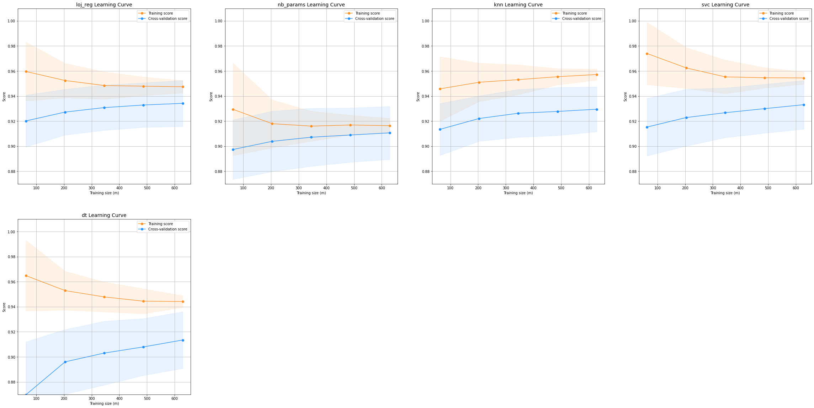
          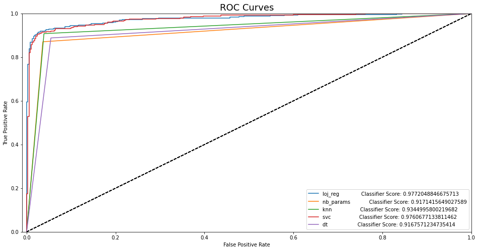
          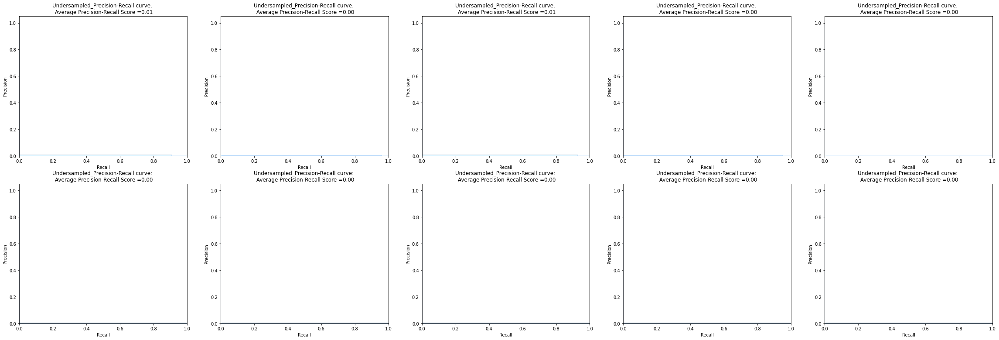
      </div>
    - Logistic regresion results [Selected Model] on __oversampled data__
      <div style="display:flex; justify-content: center; align-items:center;">
          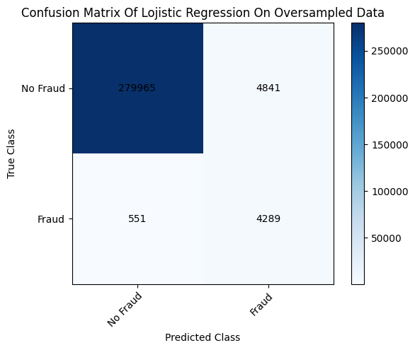
          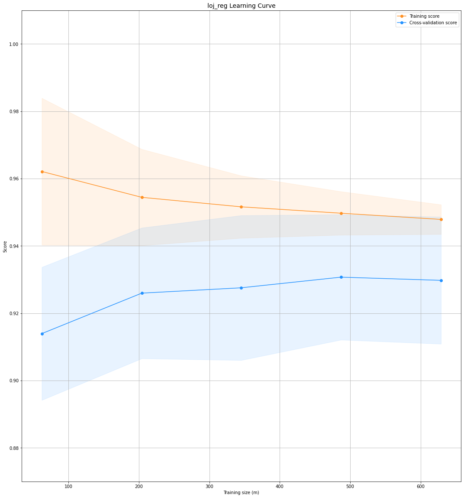
          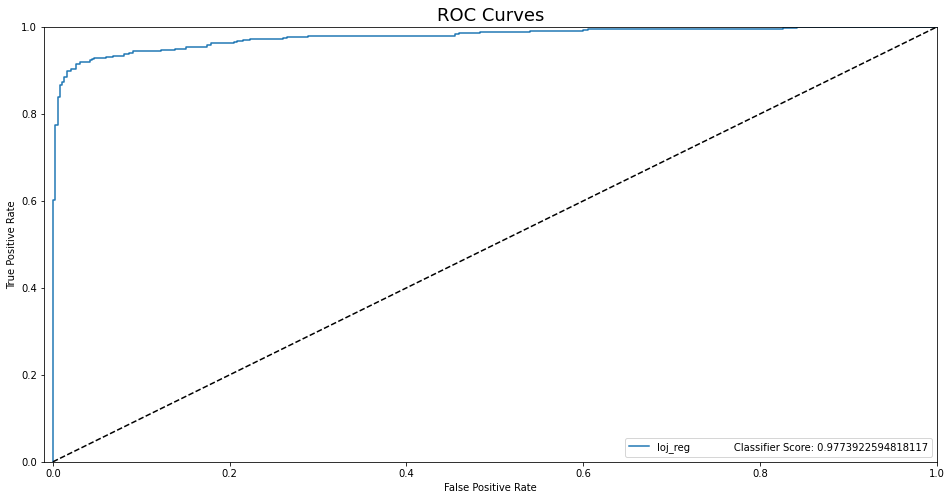
          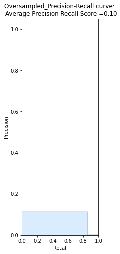
      </div>


  - Ensemble Models
    - Random Forest, Gradient Boosting Machines, XGBoost, LightGBoost, CatBoost
    - Cross Validation Scores _without balanciy process_
      | accuracy | precision |  recall  | f1_score |
      |:--------:|:---------:|:--------:|:--------:|
      |    rf    |  0.949239 | 0.949239 | 0.949239 |
      |   gbc    |  0.954315 | 0.954315 | 0.954315 |
      |   xgbc   |  0.954315 | 0.954315 | 0.954315 |
      |   lgbm   |  0.949239 | 0.949239 | 0.949239 |
      |    cb    |  0.959391 | 0.959391 | 0.959391 |
    - Cross Validation Scores _without balanciy process_
      | Model | Precision | Recall | F1-Score | Support |
      | --- | --- | --- | --- | --- |
      | rf 
      | No Fraud| 1.00 | 0.03 | 0.06 | 56863 |
      | Fraud| 0.00 | 0.99 | 0.00 | 98 |
      | accuracy | | | 0.03 | 56961 |
      | micro avg | 0.03 | 0.03 | 0.03 | 56961 |
      | weighted avg | 1.00 | 0.03 | 0.06 | 56961 |
      | --- | --- | --- | --- | --- |
      | gbc
      | No Fraud        | 1.00      | 0.05   | 0.09     | 56863   |
      | Fraud           | 0.00      | 0.99   | 0.00     | 98      |
      | accuracy        |           | 0.05   |          | 56961   |
      | macro avg       | 0.50      | 0.52   | 0.05     | 56961   |
      | weighted avg    | 1.00      | 0.05   | 0.09     | 56961   |
      | --- | --- | --- | --- | --- |
      | xgbc
      | No Fraud        | 1.00      | 0.08   | 0.14     | 56863   |
      | Fraud           | 0.00      | 0.99   | 0.00     | 98      |
      | accuracy        |           | 0.08   |          | 56961   |
      | macro avg       | 0.50      | 0.53   | 0.07     | 56961   |
      | weighted avg    | 1.00      | 0.08   | 0.14     | 56961   |
      | --- | --- | --- | --- | --- |
      | lgbm
      | No Fraud        | 1.00      | 0.09   | 0.16     | 56863   |
      | Fraud           | 0.00      | 0.99   | 0.00     | 98      |
      | accuracy        |           | 0.09   |          | 56961   |
      | macro avg       | 0.50      | 0.54   | 0.08     | 56961   |
      | weighted avg    | 1.00      | 0.09   | 0.16     | 56961   |
      | --- | --- | --- | --- | --- |
      | cb
      | No Fraud        | 1.00      | 0.08   | 0.16     | 56863   |
      | Fraud           | 0.00      | 0.99   | 0.00     | 98      |
      | accuracy        |           | 0.09   |          | 56961   |
      | macro avg       | 0.50      | 0.54   | 0.08     | 56961   |
      | weighted avg    | 1.00      | 0.09   | 0.15     | 56961   |


#### __(F) Saving the project__: 
  - Saving the project and demo studies.
    - trained model __loj_ref.sav__ as pickle format.
#### __(G) Deployment as web demo app__: 
  - Creating Gradio Web app to Demostrate the project.Then Serving the demo via huggingface as live.
  - Desciption
    - Project goal is classify the survive situation of the passengers  based on four features.
    - Usage: Set the feature values through sliding the radio buttons and dropdown menu then use the button to predict.
  - Demo
    - The demo app in the demo_app folder as an individual project. All the requirements and dependencies are in there. You can run it anywhere if you install the requirements.txt.
    - You can find the live demo as huggingface space in this [demo link](https://ertugruldemir-creditcardfrauddetection.hf.space) as full web page or you can also us the [embedded demo widget](#demo)  in this document.  
    
## License
- This project is licensed under the Apache 2.0 License. See the [LICENSE](LICENSE) file for details.

<h1 style="text-align: center;">Connection Links</h1>

<div style="text-align: center;">
    <a href="ertugrulbusiness@gmail.com"></a>
    <a href="https://tr.linkedin.com/in/ertu%C4%9Fruldemir?original_referer=https%3A%2F%2Fwww.google.com%2F"></a>
    <a href="https://github.com/ertugruldmr"></a>
    <a href="https://www.kaggle.com/erturuldemir"></a>
    <a href="https://huggingface.co/ErtugrulDemir"></a>
    <a href="https://stackoverflow.com/users/21569249/ertu%c4%9frul-demir?tab=profile"></a>
    <a href="https://www.hackerrank.com/ertugrulbusiness"></a>
    <a href="https://app.patika.dev/ertugruldmr"></a>
    <a href="https://medium.com/@ertugrulbusiness"></a>
    <a href="https://www.youtube.com/channel/UCB0_UTu-zbIsoRBHgpsrlsA"></a>
</div>

